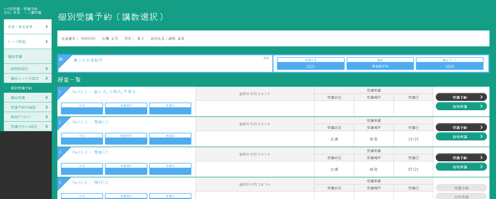
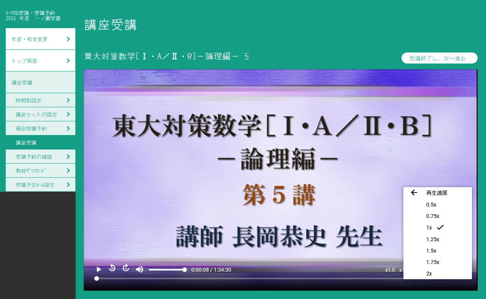

# ToshinFox

## 紹介

ToshinFoxはオープンソースの東進Firefox受講用の拡張です。
WindowsだけではなくMacやLinuxでの受講を可能にします。
現在、公式でもChromeと新しいEdgeは対応していますが、動作が微妙なのでこれを使うと学習がより捗ると思います。

注目の機能 :

- **授業プレイヤースクリプトの挿入**: Internet Explorer以外(Firefox)での受講を可能にします
- **かんたん再ログイン**: セッション情報破棄時に自動でリダイレクト
- **カスタムフォント**: 筆記体や丸文字などの自由なフォントを選べます！
- **IEにさようならを言おう！**: IE使えメッセージの除去
- **連打クリック警告さようなら**: 要らない警告メッセージを削除
- **再生速度**: x1.25とx2.0もあります！
- **Picture in Picture**: 受講もPiPで！(これ使うやつ絶対、授業聞いてないだろ)
- **5秒送り10秒戻し**
- **高速マスター高速化**: 次の問題に瞬時に移るようになります
- **高速マスター問題埋め込み**: 高速マスターの結果を見るときに単語問題を埋め込むように(従来は「問題へ」ボタンを押して別のタブで開く必要があった)
- **確認テスト無記入バグ修正**: Firefoxで起こる確認テストや修了テストの未記入バグを直します
- **過去問二次講座 force new tab**: 新しいウインドウではなく、タブで開くようにします。
## スクリーンショット

|  |  
| ------------------------------------------------------------------------------------- | -------------------------------------------------------------------------------- |

## ブラウザ&OSの対応

- Windows 10 & Windows 11 : 完全対応
- Ubuntu 21.04 Desktop : 完全対応
- macOS v10.15 Catalina : 完全対応

## 便利なリンク

- [Firefoxで署名されていない拡張を入れる->未署名のアドオンを有効にする](https://developer.mozilla.org/ja/docs/Mozilla/Add-ons/WebExtensions/Packaging_and_installation)

## バグ報告

環境や何の講座かを添えて、Issuesまでどうぞ

## 開発と仕組みについて

東進PoSはWindowsのIEではSmoothstreamingでSilverlightというデジタル著作権保護技術を、AndroidとiOSではdash(mpd)でGoogleのWidevineと言うデジタル著作権保護技術を使っています。
Silverlight技術はWindowsのIEでのみ動くのに対して、Widevineは一般的なDRM(デジタル著作権保護)技術として利用されており、モダンブラウザやOSが対応しています。身近なサービスでこれを利用しているのはDアニメがあります。

これは著作権保護を外しているのではなくWidevineという著作権保護技術を使って再生しているだけです。そのため講義のダウンロードなどはできません。

## Silverlightの未来

["Silverlight End of Support"](https://support.microsoft.com/en-gb/help/4511036/silverlight-end-of-support)

Microsoft Silverlightは2021年の10月12日に終わりを迎えます。(`the Silverlight installer will no longer be available after the end of support date of October 12, 2021.`とあるのでダウンロードもできなくなります)Silverlight 開発フレームワークは現在Internet Explorer 11のみをサポートしていて、既にInternet Explorer 10のサポートは2020年の1月31日で終了しています。そしてもう、Chrome, Firefoxや他のブラウザ、そしてmacOSでは対応していません。